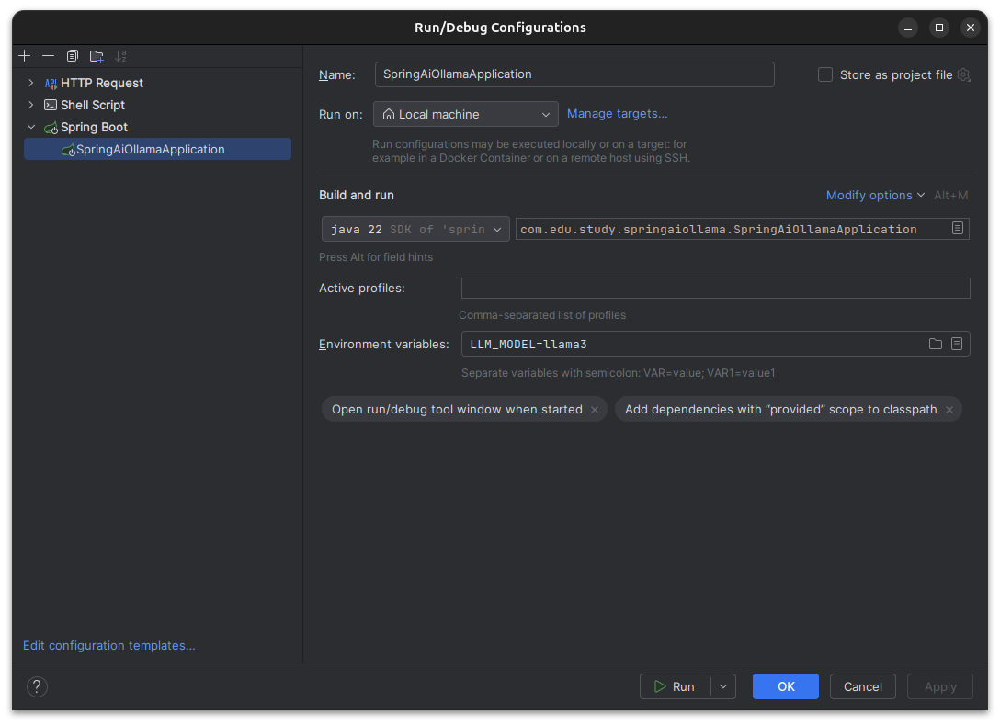
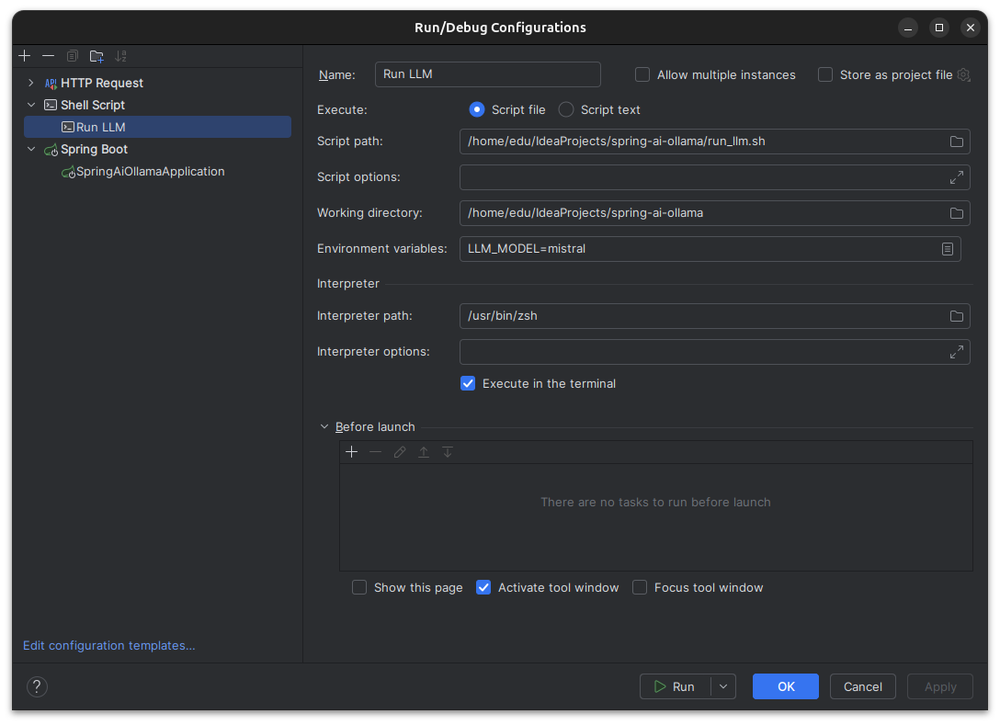

# Spring AI Ollama

## Running configurations

### Starting a LLM
After starts the application, certifies that the Ollama container is running and run the script ```run_llm.sh``` passing
a value to the environment variable ```LLM_MODEL```. This script is used to install a LLM into the Ollama container, so
it should be running at the moment you execute the script.

### Ollama Container
You can find more options about to run the Ollama container in: [Ollama Dockerhub page](https://hub.docker.com/r/ollama/ollama)

### Post LLM Script
You don´t need to run the script to install the LLM everytime you start the application, but when you delete the container.

### Application properties

The application needs some environment variables to be set, when you need something different from the default. Follows 
them:

| EV | Default                |
|----|------------------------|
| LLM_MODEL | llama3                 |
| LLM_URL   | http://localhost:11434 |
| LLM_TEMP  | 0.7                    |

### Idea Configurations

To easily run the script and redefine the environment variables you can use the Idea configuration to do it, as the images
shows below:
#### Spring Run Configuration example

#### Run LLM script configuration example


## Application Usage

For now, the application usage is very simple, there is only one endpoint that receives a message as a user prompt and
returns the response that is coming.

Follows an HTTP request example:

```http request
### POST example to send a message prompt to AI
POST localhost:8080/ai
Content-Type: application/json

{
  "prompt": "What is the greatest country in the planet?"
}

###
```

## Next Steps

### Increase Prompt

- Add more prompt profiles
- Add prompt templates

### Add RAG

- Add vector database
- Add embeddings
- Add search
- Add request with embeddings 

### Improve output

Add new approaches, like:

- Mixture of Experts (MoE)
- Mixture of Agents (MoA)
- Mixture-of-LoRAs
